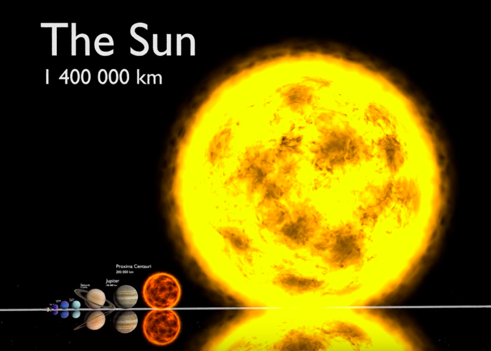
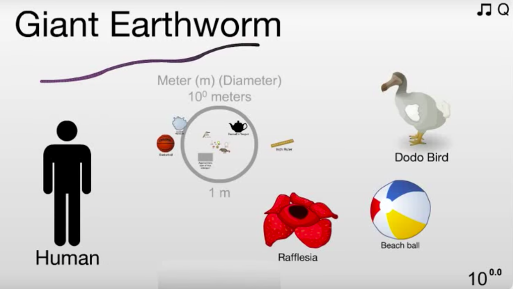

# Tópicos em Ciêncas - Módulo Astronomia   

Este website cobre o Módulo de Astronomia da turma B do curso de Tópicos em Ciências do curso de Bacharelado em Ciências da Matemática e da Terra.

___

## Datas Relevantes

 - Início do Módulo: 21 de setembro de 2018

 - Fim do Módulo: 26 de outubro de 2018

 - Prova do Módulo de Astronomia: 26 de outubro de 2018

 - Semana SIAC/UFRJ - sem aulas, dias 17 e 19 de outubro de 2018

 - Feriados - sem aulas, dias 12 e 15 de outubro

___

## Aulas

- Aula 01 - [Introdução](./lectures/aula1carreira.pdf) -- [Escalas de Tamanho](./lectures/aula2_Escalas.pdf) 

- Aula 02 - [Coordenadas e Movimento dos Astros](./lectures/aula4_Movimento_Terra.pdf)

- Aula 03 - [O Sol, a Lua e a Terra: Eclipses (sem arquivo)]()

- Aula 04 - [Atividade Solar e Formação da Lua (sem arquivo)]()

- Aula 05 - [Propriedades do Sistema Solar (sem arquivo)]()

- Aula 06 - [Asteroides e Cometas (sem arquivo)]()

- Aula 07 - [Planetas Extrassolares, Vida e o Projeto SETI (sem arquivo)]()

- Aula 08 - [Radiação Eletromagnética (sem arquivo)]()

- Aula 09 - [Estrelas e Evolução Estelar (sem arquivo)]()

- Aula 10 - [A Via Láctea (sem arquivo)]()

- Aula 11 - [Galáxias e Classificação de Hubble (sem arquivo)]()

- Aula 12 - [Prova (sem arquivo)]()

___

## Guia de Estudo/Lista de Exercícios

___

## Youtube Videos: 

 - Video 1: Escalas do Universo
 

- Video 2: Escalas de Tamanhos
 

___

## Material Adicional: 

- [Exploração Espacial](./lectures/aula3_Exploracao_Espacial.pdf)

- [Sol da Meia-Noite - em inglês](https://www.scienceabc.com/pure-sciences/midnight-sun-what-is-it-and-why-does-it-occur.html)