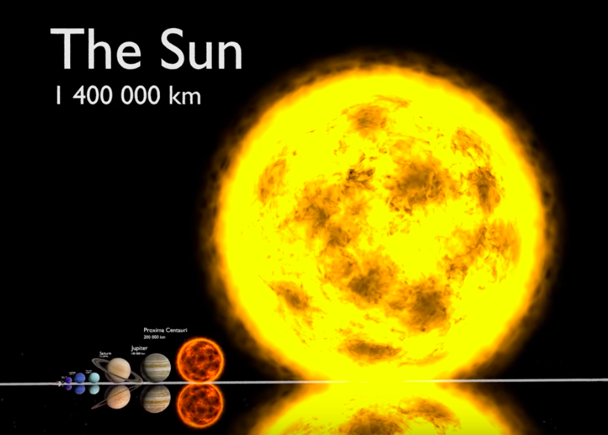
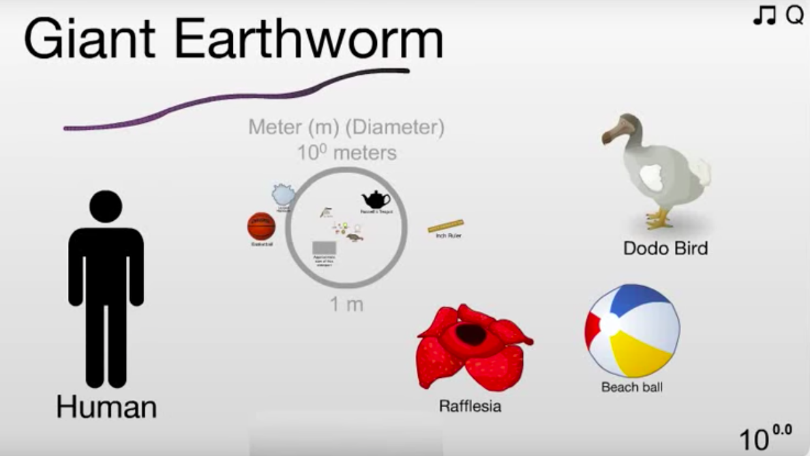
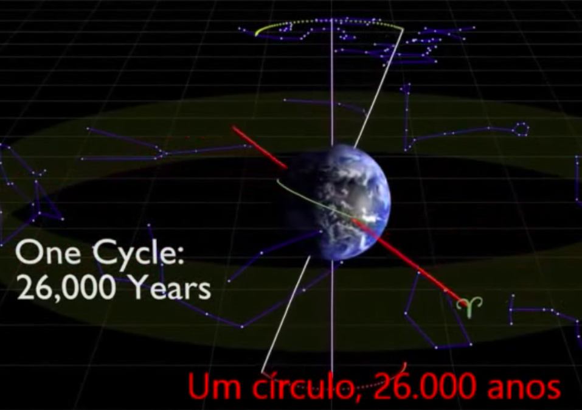

# Tópicos em Ciências - Módulo Astronomia   

Este website cobre o Módulo de Astronomia da turma B do curso de Tópicos em Ciências do curso de Bacharelado em Ciências da Matemática e da Terra, em 2018B.

___

## Datas Relevantes

 - Início do Módulo: 21 de setembro de 2018

 - Fim do Módulo: 26 de outubro de 2018

 - Prova do Módulo de Astronomia: 26 de outubro de 2018

 - Semana SIAC/UFRJ - sem aulas, dias 17 e 19 de outubro de 2018

 - Feriados - sem aulas, dias 12 e 15 de outubro

___

## Aulas

O material (slides) utilizado em sala de aula foi preparado pela prof. Dra. Silvia Lorenz-Martins (OV/UFRJ). Ela compila todo o conteúdo necessário para a disciplina de Tópicos com informações adicionais.

- Aula 01 - 21/09 - [Introdução](./lectures/aula1carreira.pdf) -- [Escalas de Tamanho](./lectures/aula2_Escalas.pdf) 

- Aula 02 - 24/09 - [Coordenadas e Movimento dos Astros](./lectures/aula4_Movimento_Terra.pdf)

- Aula 03 - 26/09 - [O Sol, a Lua e a Terra: Eclipses (sem arquivo)]()

- Aula 04 - 28/09 - [Atividade Solar e Formação da Lua (sem arquivo)]()

- Aula 05 - 01/10 - [Propriedades do Sistema Solar (sem arquivo)]()

- Aula 06 - 03/10 - [Asteroides e Cometas (sem arquivo)]()

- Aula 07 - 05/10 - [Planetas Extrassolares, Vida e o Projeto SETI (sem arquivo)]()

- Aula 08 - 08/10 - [Radiação Eletromagnética (sem arquivo)]()

- Aula 09 - 10/10 - [Estrelas e Evolução Estelar (sem arquivo)]()

- Aula 10 - 22/10 - [A Via Láctea (sem arquivo)]()

- Aula 11 - 24/10 - [Galáxias e Classificação de Hubble (sem arquivo)]()

- Aula 12 - 26/10 - [Prova (sem arquivo)]()

___

## Monitoria

A monitora Stephanie Mortera estará ajudando a turma B de Tópicos todas às segundas de 15-17h, e às quintas de 12-13h.

Ela combinou de caso ninguém apareça até 16:15 nas segundas, ela iria embora. Ela também irá ajudar no guia de estudo/listas.

___

## Guia de Estudo/Lista de Exercícios

___

## Material Adicional: 

- [Exploração Espacial](./lectures/aula3_Exploracao_Espacial.pdf)

- [Como os gregos calcularam o tamanho da Terra - Reportagem da Revista Superinteressante](https://super.abril.com.br/mundo-estranho/como-os-gregos-calcularam-a-circunferencia-da-terra-ha-2200-anos/)

- [Sol da Meia-Noite - em inglês](https://www.scienceabc.com/pure-sciences/midnight-sun-what-is-it-and-why-does-it-occur.html)

___

## Projetos online

- Astrotubers (pt-br) - canal no YouTube

[YouTube](https://www.youtube.com/channel/UCGYBY4KaFYmkEKAGLL07BXw) -- [Twitter](https://twitter.com/astrotubers) -- [Facebook](https://www.facebook.com/AstroTubers/) -- [Instagram](https://www.instagram.com/astrotubers/)

___

## Instituições Brasileiras de Astronomia no Rio de Janeiro

- Museu de Astronomia e Ciências Afins - MAST (Rio de Janeiro/RJ)

[website](http://mast.br/pt-br/) -- [Twitter](https://twitter.com/MuseuAstronomia) -- [Facebook](https://www.facebook.com/museuastronomia/) -- [Instagram](https://www.instagram.com/museudeastronomia/)

- Museu Ciência e Vida (Duque de Caxias/RJ)

[website](http://www.museucienciaevida.com.br/) -- [Twitter](https://twitter.com/muscienciaevida) -- [Facebook](https://www.facebook.com/museucienciaevida) -- [Instagram](https://www.instagram.com/museucienciaevida/) -- [YouTube](https://www.youtube.com/channel/UCdzjlZMZafNlcAhq_Tz0jYg)

- Observatório Nacional (Rio de Janeiro/RJ)

[website](http://on.br/index.php/pt-br/) -- [Twitter](https://twitter.com/ON_MCTIC) -- [Facebook](https://www.facebook.com/observatorionacional) -- [Instagram](https://www.instagram.com/observatorionacional/) -- [YouTube](https://www.youtube.com/user/observatorionacional)

- Observatório do Valongo/UFRJ

[website](http://www.ov.ufrj.br) -- [Twitter](https://twitter.com/ValongoUFRJ) -- [Facebook](https://www.facebook.com/ValongoUFRJ/) -- [Instagram](https://www.instagram.com/valongoufrj/)

- Planetário da Gávea (Rio de Janeiro/RJ)

[website](http://www.planetariodorio.com.br/) -- [Twitter](https://twitter.com/planetariodorio) -- [Facebook](https://www.facebook.com/planetariodorio) -- [Instagram](https://www.instagram.com/planetariodorio/) -- [YouTube](https://www.youtube.com/channel/UCR39LWTg5jw3Ibwk8Vp_LVA)

___

## Softwares

- [Stellarium (Windows/Mac/Linux/iOS/Android)](https://stellarium.org/pt/)

___

## Youtube Videos: 

 - Video 1: Escalas do Universo
 

- Video 2: Escalas de Tamanhos
 

- Video 3: Movimento da Terra: Precessão
 
